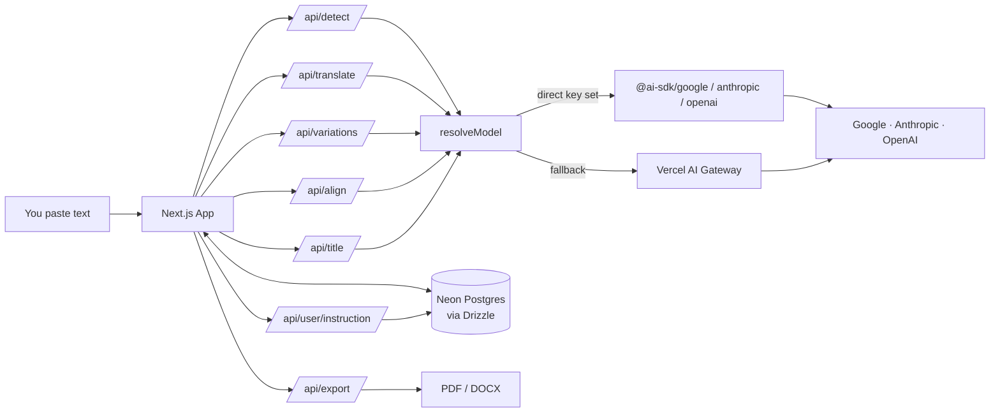

# vertor

A literary translator that actually cares about voice.

Most translation tools spit out something technically correct and tonally flat. vertor is built for translating prose where the *feel* matters — fiction, essays, copy, anything where rhythm and register are part of the meaning. Pick a model, paste your text, and get a translation that reads like it was written, not converted.

## What it does

- **Translate** whole documents while preserving paragraphs, markdown, and the author's voice. Output streams sentence by sentence.
- **Variations** — double-click a word or drag-select a phrase, sentence, paragraph, or the whole doc to get three alternative renderings in different registers (literal / natural / lyrical). Like one of them? Hit *more like this* on it to get three more in the same vein.
- **Cross-pane alignment** — select a word or phrase in either pane and the matching span lights up on the other side. A soft paragraph-level tint appears instantly (free, using the 1:1 paragraph guarantee); a single Gemini Flash-Lite call then tightens it to the exact word or phrase, cached so repeat selections are instant.
- **Read / Edit per pane** — flip either pane between raw markdown and rendered view (headings, lists, links, blockquotes). The right pane is also a real editor — fix a comma, rewrite a sentence, your edits stick.
- **Rich-text paste** — paste from Word, Google Docs, or any web page; HTML is converted to markdown on the way in so structure survives the trip. Excess blank lines from `<p><br></p>` salad get collapsed automatically.
- **Instruction with presets** — a "house style" line that's applied to every translation. Three built-in presets (British, Casual, Keep names) plus your own saved presets. The current instruction sticks across documents and sessions.
- **Revision history** (signed in) — every translation, edit, and variation lands in the timeline. Open a revision, see a side-by-side diff, restore it with one click. Auto-saves every 600ms.
- **Multi-model** — Gemini 3.1 Pro / Flash / Flash-Lite, Claude Opus 4.7 / Sonnet 4.6 / Haiku 4.5, GPT-5 / mini. Pick one in Advanced mode, or stay in Simple and the app routes to Flash-Lite (cheap, fast, fluent).
- **Auto-detect** source language; **auto-generated titles** from the first sentence (via Flash-Lite); **auto-save** with a live status chip; **copy** the translation to the clipboard with one click.
- **Dashboard** (signed in) — translation stats, language breakdown, 30-day activity sparkline, models used, plus an LLM-generated **Translator Personality** card that unlocks at 5 docs and refreshes every 5 more.
- **Export** to PDF or DOCX when you're happy with it. Headings, bold/italic, lists, blockquotes, code, and links all carry across — exports walk the markdown AST directly, no flattening.
- **Save & sign in** — Google login keeps your documents, presets, and history around. Runs fine without auth too (everything saves to your browser).

## How it works



Direct provider keys are preferred when set (cheaper, free tier on Google AI Studio, no Gateway markup). One Gateway key works as a fallback for everything. Drizzle handles the schema, Neon stores the documents (plus revisions and per-user presets), Auth.js handles Google sign-in. Alignment results are cached in-memory per session so the same word doesn't pay twice.

## Stack

- **Next.js 16** App Router + React 19
- **AI SDK v6** — direct provider clients (`@ai-sdk/google`, `@ai-sdk/anthropic`, `@ai-sdk/openai`) with Vercel AI Gateway fallback
- **Auth.js v5** (beta) + Drizzle adapter + Google OAuth
- **Drizzle ORM** + Neon Postgres
- **Tailwind v4** + shadcn/ui + Radix primitives
- **Turndown** (+ GFM plugin) for paste, **react-markdown** + **remark-gfm** for the Read view, **mdast-util-***  for DOCX/PDF export
- **Vitest** for tests

## Running it locally

You'll need pnpm. For models, either a Vercel AI Gateway key *or* direct provider keys (any combination). For sign-in + cloud save, a Neon database + Google OAuth creds.

```bash
pnpm install
cp .env.example .env.local   # fill in the values
pnpm drizzle-kit push        # apply schema to your DB (only needed if DATABASE_URL is set)
pnpm dev
```

Then open <http://localhost:3000>.

### The cheapest path

A free [Google AI Studio key](https://aistudio.google.com/apikey) in `GOOGLE_GENERATIVE_AI_API_KEY` is enough — every Google model just works, no Gateway needed. Skip `DATABASE_URL` and the app runs in local mode (history, presets, and current instruction live in your browser). Skip the `AUTH_*` vars and there's no sign-in (and no dashboard). See `.env.example` for the full list.

## Commands

```bash
pnpm dev                  # dev server
pnpm build                # production build
pnpm lint                 # ESLint
pnpm test                 # vitest, run once
pnpm test:watch           # vitest, watch mode
pnpm drizzle-kit push     # apply schema (uses DATABASE_URL)
```

## Contributing

PRs welcome. The codebase is small and readable on purpose — here's where things live:

- `src/app/api/` — route handlers (`translate`, `detect`, `variations`, `align`, `title`, `export`, `documents`, `user/instruction`, `auth`)
- `src/app/dashboard/` — signed-in dashboard (stats, sparkline, personality card)
- `src/app/(marketing)/` — landing page + intro animation
- `src/app/sign-in/` — custom editorial sign-in page
- `src/lib/prompts.ts` — all LLM prompts (edit here, not inline in routes)
- `src/lib/models.ts` — model registry; add a new model here
- `src/lib/model-client.ts` — direct-provider vs Gateway resolution
- `src/lib/languages.ts` — supported languages
- `src/lib/alignment.ts` — paragraph splitting + alignment cache
- `src/lib/instruction-store.ts` / `instruction-presets.ts` — preset + sticky-instruction storage
- `src/lib/stats.ts` — dashboard analytics
- `src/lib/personality.ts` — translator-personality generation
- `src/lib/db/schema.ts` — Drizzle schema (source of truth)
- `src/components/translator/` — the editor UI (`translator-app.tsx`, `instruction-bar.tsx`, `alignment-overlay.tsx`, `markdown-view.tsx`, `variations-popover.tsx`, `history-panel.tsx`, `diff-view.tsx`)
- `src/components/landing/` — hero, showcase, closing

If you're adding a model, just append to `MODELS` in `models.ts` with its Gateway slug. If you're tweaking translation behavior, `prompts.ts` is the one file you want.

## Feature requests & bugs

[Open an issue](https://github.com/RumiAllbert/vertor/issues). Be casual about it — a couple of sentences and a screenshot is plenty. If it's a translation quality complaint, paste the source, the output, and which model you used.

For bigger ideas (new export formats, glossary support, side-by-side diff view, etc.) feel free to open a discussion-style issue first so we can sketch it out before anyone writes code.

## License

[MIT](LICENSE). Use it, fork it, ship something with it. A nod back is appreciated but not required.
