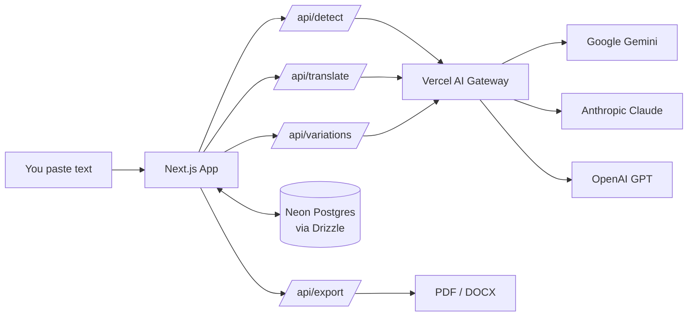

# vertor

A literary translator that actually cares about voice.

Most translation tools spit out something technically correct and tonally flat. vertor is built for translating prose where the *feel* matters — fiction, essays, copy, anything where rhythm and register are part of the meaning. Pick a model, paste your text, and get a translation that reads like it was written, not converted.

## What it does

- **Translate** whole documents while preserving paragraphs, markdown, and the author's voice
- **Variations** — click any word, phrase, paragraph, or the whole text and get three alternative renderings with different tone or syntax
- **Multi-model** — pick between Gemini, Claude, and GPT through a single dropdown, all routed via [Vercel AI Gateway](https://vercel.com/docs/ai-gateway)
- **Export** to PDF or DOCX when you're happy with it
- **Save & sign in** — Google login keeps your documents around (optional, runs fine without auth too)

## How it works



One Gateway key, all the providers. Drizzle handles the schema, Neon stores the documents, Auth.js handles Google sign-in. Nothing fancy, just composed well.

## Stack

- **Next.js 16** App Router + React 19
- **AI SDK v6** through Vercel AI Gateway
- **Auth.js v5** (beta) + Drizzle adapter + Google OAuth
- **Drizzle ORM** + Neon Postgres
- **Tailwind v4** + shadcn/ui

## Running it locally

You'll need pnpm, a Vercel account (for the AI Gateway key + Neon), and Google OAuth creds if you want sign-in.

```bash
pnpm install
cp .env.example .env.local   # fill in the values
pnpm drizzle-kit push        # apply schema to your DB
pnpm dev
```

Then open http://localhost:3000.

`.env.example` lists what's needed — the short version: an `AI_GATEWAY_API_KEY`, a `DATABASE_URL`, and the three `AUTH_*` vars. If you skip the auth vars the app still runs, just without sign-in or saved docs.

## Contributing

PRs welcome. The codebase is small and readable on purpose — here's where things live:

- `src/app/api/` — the route handlers
- `src/lib/prompts.ts` — all LLM prompts (edit here, not inline in routes)
- `src/lib/models.ts` — model registry; add a new model here
- `src/lib/languages.ts` — supported languages
- `src/components/translator/` — the UI

If you're adding a model, just append to `MODELS` in `models.ts` with its Gateway slug. If you're tweaking translation behavior, `prompts.ts` is the one file you want.

## Feature requests & bugs

[Open an issue](https://github.com/RumiAllbert/vertor/issues). Be casual about it — a couple of sentences and a screenshot is plenty. If it's a translation quality complaint, paste the source, the output, and which model you used.

For bigger ideas (new export formats, glossary support, side-by-side diff view, etc.) feel free to open a discussion-style issue first so we can sketch it out before anyone writes code.

## License

[MIT](LICENSE). Use it, fork it, ship something with it. A nod back is appreciated but not required.
